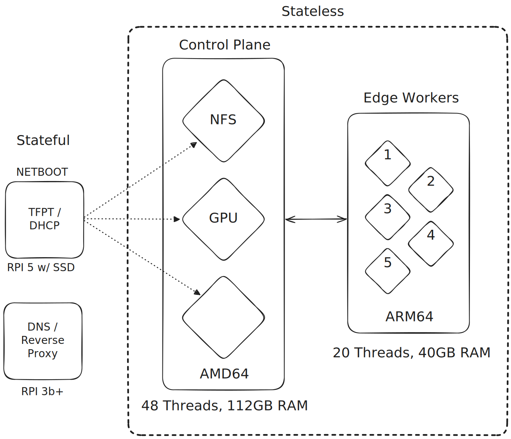

# homelab

Code base for my homelab setup

## Homelab Details

| Resrouce      | Device                | Hardware                    | Notes                          |
| ------------- | --------------------- | --------------------------- | ------------------------------ |
| network       | Unifi w/ VLAN         | Unifi Dream Router          | Homelab Network VLAN 10.0.0.10 |
| pihole        | Raspberry PI 3b+      | 4 cores, 4 threads, 1GB RAM | DNS / Reverse Proxy            |
| cluster state | Raspberry PI 5 w/ SSD | 4 cores, 4 threads, 8GB RAM | NETBOOT (DHCP, TFTP, NFS)      |

### Cluster Details

| Node       | Description        | Hardware                       | Other     | Notes              |
| ---------- | ------------------ | ------------------------------ | --------- | ------------------ |
| cp-1       | Custom AMD Build   | 4 cores, 4 threads, 16GB RAM   | 20TB Raid | NFS                |
| cp-2       | Custom AMD Build   | 12 cores, 24 threads, 64GB RAM | 20GB VRAM | Inference Node     |
| cp-3       | Custom Intel Build | 14 cores, 20 threads, 32GB RAM |           | AMD64 Compute Node |
| arm-node-1 | Raspberry PI 5     | 4 cores, 4 threads, 8GB RAM    |           | ARM64 Compute Node |
| arm-node-2 | Raspberry PI 5     | 4 cores, 4 threads, 8GB RAM    |           | ARM64 Compute Node |
| arm-node-3 | Raspberry PI 5     | 4 cores, 4 threads, 8GB RAM    |           | ARM64 Compute Node |
| arm-node-4 | Raspberry PI 5     | 4 cores, 4 threads, 8GB RAM    |           | ARM64 Compute Node |
| arm-node-5 | Raspberry PI 5     | 4 cores, 4 threads, 8GB RAM    |           | ARM64 Compute Node |

| Cluster Totals |
| -------------- |
| 8 Nodes        |
| 50 Cores       |
| 68 Threads     |
| 132 GB RAM     |
| 20TB Storage   |
| 20GB VRAM      |

| Cluster Features       |
| ---------------------- |
| Network Boots          |
| Automated Provisioning |
| Multi Architecture     |
| More to Come...        |
| SSD Raid Pool          |
